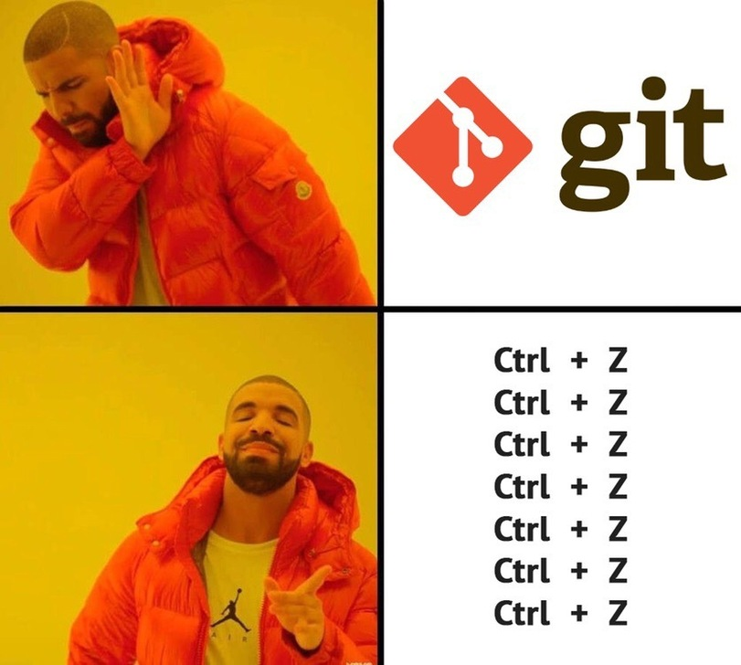
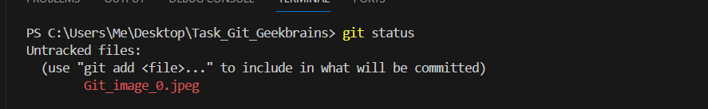
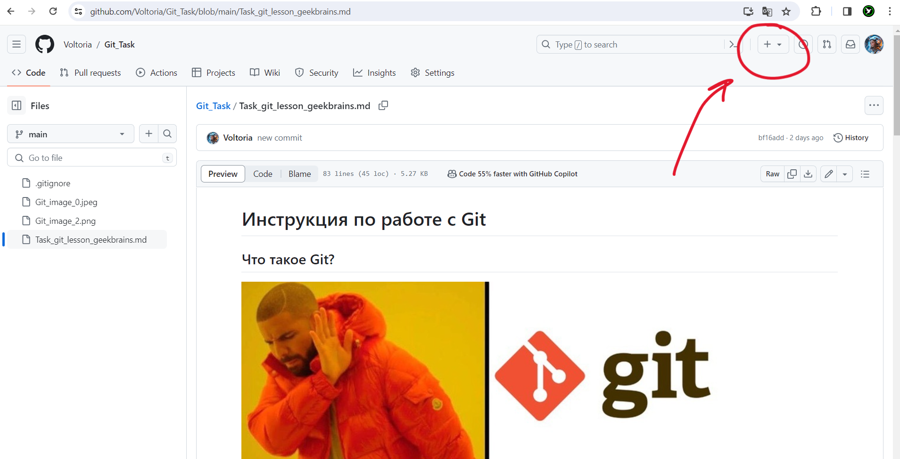
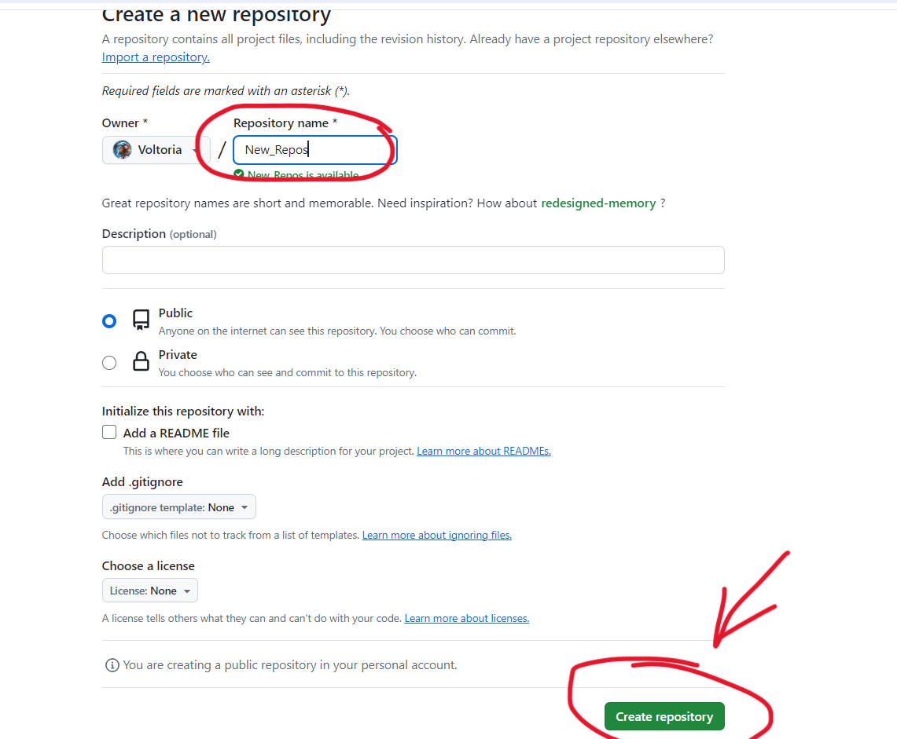
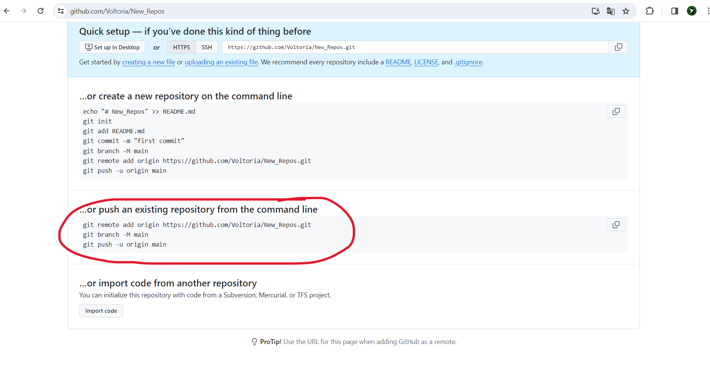
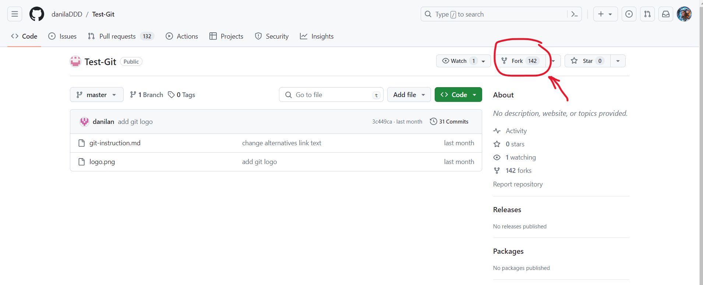

# Инструкция по работе с Git 

## Что такое Git? 

Git - это программа, для отслеживания и сохранения версий файлов в нашем проекте. Необходимый инструмент в профессии программиста, который упрощает работу и дает возможность работать целой команде программистов над одним проектом. 

## Инициализация 

Для начала работы необходимо выполнить инициализацию. Делается это через команду **git init** в терминале. 

Как сказал один мудреший человек :
>"*Программисты - люди ленивые, так что слово initialization сократили до init.*"

### Что такое коммит
Коммит - это фиксация изменений в файле.   

## Добавить коммит 

Чтобы добавить новый коммит, нужно сделать ~~ритуальный призыв умного друга-программиста~~ эти 3 шага :

1. Сохранить файл 

Так как мы - продвинутые программисты, делаем это через сочетание клавиш Ctrl+S. 

2. Добавить файл в отслеживаемые гитом 

Для этого вызываем команду git add имя файла. Для упрощения работы программистам, в гите есть функция автозаполнения. Чтобы не писать название файла вручную, используем клавишу TAB.

3. Вызвать команду **git commit** -m "здесь пишем комментарий к изменениям"

### git log 

Команда **git log** позволяет увидеть все сделанные нами коммиты с комментариями.  

## Переход между коммитами 

Переключаться между версиями позволяет команда **git checkout**. 

### Как перейти на другую версию файла
Для того, чтобы перейти на другую версию файла (коммит), необходимо вызвать **git log**. Найти интересующий нас коммит можно по комментарию. Рядом со словом commit найдем его номер и скопируем.
После git ckeckout можно ввести весь номер коммита, а можно первые 4 цифры номера. Гит поймет какой коммит от него нужен. 

### Git checkout master

Чтобы вернуться к актуальному состоянию файла и продолжить работу, необходимо вызвать команду git checkout master.
Так мы переходим на ветку master, на которой по умолчанию пишется текущее состояние файла.  

## git status 

Посмотреть актуальное состояние проекта позволяет команда **git status**. Если в файл был изменен, но нет коммита или есть файлы которые не отслеживаются, **git status** сообщит нам об этом. Например, вот так: 

## Ветки

### Создание ветки

Для создания ветки, необходимо использовать команду git checkout *Имя ветки*. Например :

Git checkout about_branch

### Git branch 

Для просмотра всех существующих веток используется команда **git branch**. Та ветка, на которой мы сейчас находимся, отмечена звёздочкой. 

### Переход на другую ветку

Для перехода на другую ветку, необходимо использовать команду **git checkout** *название ветки, на которую требуется перейти*. Актуальная версия файла, находится на ветке **main**. 

### Слияние 

Слияие веток можно выполнить следующим образом: 

1. Перейти на основную ветку, с которой выполняем слияние, с помощью команды **git checkout** *название основной ветки*
2. Вызываем команду **git merge** *имя ветки, которую присоединяем*
3. После присоединения, дополнительную ветку можно удалить. Для этого нужно вызвать команду **git branch** с флагом -d *название ветки, которую нужно удалить*. Например:

git branch -d BranchVanish

## Работа с удаленными репозиториями

Удаленные репозитории полезны тем, что наш проект могут видеть другие люди и предлагать изменения. 

### Как скопировать чужой репозиторий 

Чтобы скопировать чужой проект с github к себе на компьютер необязательно иметь там свой аккаунт.
Единственное, что необходимо - это найти интересующий нас репозиторий, найти вкладку Code, скопировать ссылку и через команду **git clone** *ссылка на реп.*  склонировать себе на компьютер проект. 

### Как создать репозиторий на сайте GitHub

Необходимо войти в свой аккаунт на сайте github.com ( если его нет - создать, ~~купить, украсть~~). 

Сверху найти кнопочку плюсика - Create new.... new repository. 

Задать имя, параметры приватности, настройки .gitignore, лицензии и нажать на кнопку Create repository.

Далее у нас появляется ссылка на репозиторий и инструкции.

Чтобы загрузить проект с локального компьютера последуем пункту push an existing repository from the command line в нашем проекте. 
Связываем наш локальный репозиторий с репозиторием в интернете. 
Указываем какая ветка будет являться основной. 
Направляем наш проект в интернет. 

Если всё прошло успешно, в терминале сообщений об ошибках не будет, а на сайте github по ссылке репозитория появятся файлы нашего проекта. 

### Подгрузка изменений с сайта в локальный репозиторий

Если изменения в репозитории были проведены на сайте github и необходимо их перенести к себе на компьютер (локальный репозиторий), нужно воспользоваться командой **git pull**. Эта команда "подтянет" все изменения с сервера и выполнит слияние версий. 

## Внесение изменений в чужой проект 

В opensource проектах множество людей могут предлагать свои изменения хозяину исходного проекта.  

Для начала необходимо сделать свою копию чужого репозитория, делается это с помощью кнопки Fork.

Точная копия репозитория появится в нашем аккаунте на github. 

### Клонирование репозиториян на локальный компьютер 

Для работы над репозиторием на локальном компьютере нужно воспользоваться кнопкой Code, cкопировать ссылку и вызвать команду в терминале **git clone**. 

После внесения изменений, можно направить новую верию файла в удаленный репозиторий, на github с помощью команды **git push**. 

### Как предложить изменнеия хозяину репозитория 

После вливания копии с локального компьютера на удаленный репозиторий, появится кнопка " Compare & Pull request "

Заполняем поля с описанием и отправляем - **Create Pull request**. 

При этом хозяин проекта может просмотреть изменения и если они ему понравятся - слить предложенные изменения с основным проектом. 